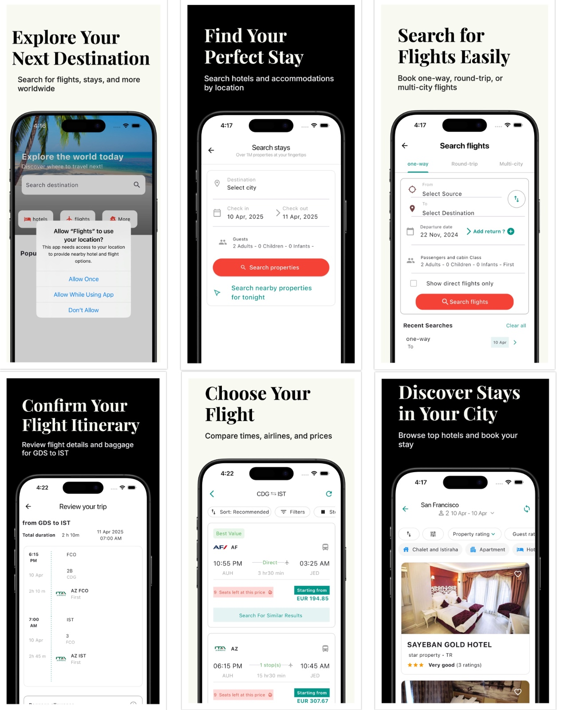

# Flights - Flight Search & Booking App

A comprehensive Flutter application for flight search, booking, and travel management.

## Project Overview

This Flutter application provides a complete solution for flight search, booking, and travel management. The app uses Hive for local storage and SharedPreferences for persistent data management.

## Project Screenshots

## Key Features

- **Flight Search & Booking**
  - Search flights with flexible date options
  - View flight details and pricing
  - Book flights directly through the app

- **Traveler Management**
  - Store and manage traveler details
  - Multiple traveler profiles support
  - Quick access to booking history

- **Hotel Integration**
  - Hotel search and booking capabilities
  - Seamless integration with flight bookings
  - Location-based hotel recommendations

## Technical Implementation

The app uses several key Flutter packages:
- `hive_flutter` for local database management
- `shared_preferences` for persistent storage
- Custom widgets and screens for a native feel

## Project Structure

The application is organized into the following key components:
- `main.dart`: Entry point with Hive and SharedPreferences initialization
- `search_flight_app.dart`: Main application widget
- Hive boxes for data management:
  - `flightData`: Stores flight information
  - `travelerDetails`: Manages traveler profiles
  - `hotelData`: Handles hotel-related data

## Getting Started

A few resources to get you started if this is your first Flutter project:

- [Lab: Write your first Flutter app](https://docs.flutter.dev/get-started/codelab)
- [Cookbook: Useful Flutter samples](https://docs.flutter.dev/cookbook)

For help getting started with Flutter development, view the
[online documentation](https://docs.flutter.dev/), which offers tutorials,
samples, guidance on mobile development, and a full API reference.
